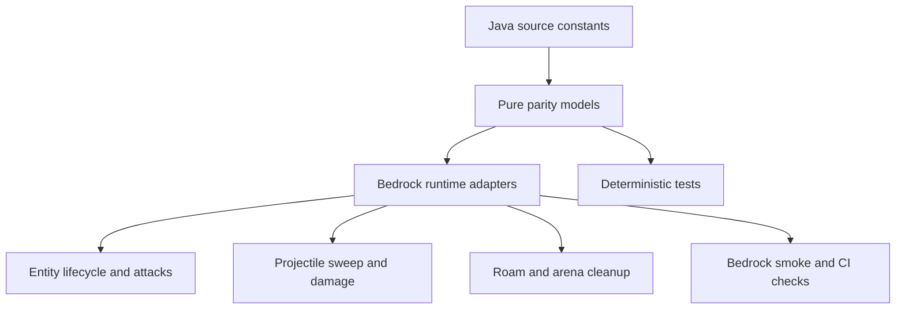

# Jimmy, Fractured, and FracturedRoam Parity Design

**Date:** 2026-09-15
**Source checklist:** `Todo.md`, item 9
**Implementation branch:** `codex/jimmy-fractured-parity-9`

## Goal

Finish the source-verifiable Jimmy / Fractured / FracturedRoam parity work while keeping Bedrock-only adaptations explicit and testable. The implementation will cover lifecycle timing, attack selection, damage and impulse plans, multipart projectile filtering, Roam movement gates, and JimArena cleanup. Exact rendered-bone origins and exact melee hit locations will remain capability-bounded adapters because the current Bedrock Script API does not expose either operation.

## Source and API findings

The Java decompilation is the behavioral source of truth. The relevant source facts are:

- `BaseFracturedEntity` uses `RISING`, `NORMAL`, `DIGGING`, `UNDERGROUND`, `ATTACKING`, `DEFEATED`, `DESPAWNING`, and `SWITCHING`; its rise, dig, and switch durations are 149, 103, and 103 ticks.
- The rising damage window is the post-decrement interval where `riseAnimTick` is 55 through 103. It affects grounded players within 30 blocks, deals 19 damage with `JIMMY_RISE`, and applies the source look-direction impulse.
- Jimmy's real attacks have equal weight 1.0 and no previous-attack exclusion. A repeated attack is therefore legal when its other gates pass.
- The attack lengths and animation events are Stomp 78 ticks / `SingleStomp` at 0.68 seconds, Slam 78 / `Slam` at 1.23 seconds, Moon Rock Toss 139 / `OffenseRockGrab` at 1.41 seconds and `OffenseRockThrow` at 5.24 seconds, and Air Lift 60 / `DefensiveRockRelease` at 2.27 seconds.
- The six logical multipart regions are head, chest, front-left, front-right, back-left, and back-right. Their source dimensions and yaw-relative offsets are preserved by the existing model; the new filter will add swept-segment coverage.
- FracturedRoam only starts digging from `NORMAL` when its cooldown is clear and its one-in-1000 eligibility roll is 1. Underground no-target navigation uses a 30-block horizontal random position; normal strolling uses 100 blocks. Rising, underground, switching, and despawning state gates must not be bypassed.
- JimArena tracks the server player roster, starts intro audio, transitions to loop audio after 340 ticks, summons 30 SA2 entities, stops all tracked audio on reset, and must not retain stale player or audio references.

The official Bedrock API exposes entity AABBs, rotation, movement, teleportation, damage, and impulses. `EntityHurtBeforeEvent` exposes the hurt entity and damage source but no impact coordinate. Bedrock geometry locators follow animated bones in the resource-pack renderer, but there is no current server-side getter for a rendered bone's world transform. The implementation consequently uses injectable contact-origin adapters with the current root-position fallback and records that limitation in the parity documentation.

## Architecture

The existing pure model modules remain the contract layer and `fractured_runtime.js` remains the Bedrock adapter. The change will extend the model layer with deterministic plans rather than embedding source constants directly in event handlers.

### Model layer

- `fractured_attack_model.js` will expose candidate metadata and rising-wave planning, including the source damage identifier, grounded/range gates, timing window, and repeat-allowed selection contract.
- `fractured_multipart_model.js` will expose a segment-sweep hit plan. It will transform the six source AABBs using body yaw, test a projectile path at deterministic substeps, and return the earliest hit with stable part-order tie breaking.
- `fractured_roam_model.js` will expose exact lifecycle boundary steps, normal-versus-underground target ranges, and roster transitions used by JimArena cleanup tests.
- `fractured_animation_model.js` will remain the single source for lengths and event seconds/ticks. Contact events will accept an optional origin resolver and otherwise use a documented root fallback.

### Runtime layer

`fractured_runtime.js` will:

1. Track the base lifecycle for both regular Fractured and FracturedRoam, including the 149-tick rising counter, the 103-tick dig/switch/despawn counters, presentation transitions, and safe-ground recovery.
2. Dispatch the source-backed rising pulse with `thebrokenscript:jimmy_rise`, parameterized pulse range and damage instead of reusing the stomp source.
3. Preserve the Java attack selector semantics: all four real attacks are eligible, each has weight 1.0, and there is no artificial previous-attack exclusion.
4. Retain projectile position history by projectile id and use a swept segment when evaluating multipart hits. If history is unavailable, the current impact point is used as a zero-length segment.
5. Resolve attack contact origins through an optional runtime adapter. Missing or invalid adapter output falls back to the entity location, so animation events remain functional on current Bedrock builds.
6. Use a 30-block underground random target and a 100-block normal Roam target, while preserving player-target and state gates.
7. Refresh JimArena player identities each tick, remove missing/reconnected instances safely, and stop every tracked sound handle during failure or reset.

The runtime will not fabricate a bone transform, infer a melee impact point that Bedrock does not provide, or make the root collision envelope pretend to be six server entities.

## Data flow

Per-tick lifecycle flow:

1. Read the entity's tracked state and current Bedrock location/rotation.
2. Apply the source decrement-before-transition rule.
3. Emit a rising pulse only while the post-decrement counter is in the source window.
4. Run attack, movement, Roam, and arena logic using each source goal's gates; regular Jimmy keeps the selector's `NOOP`/delay/target gates, while Roam movement and digging remain `NORMAL`-gated.
5. Store projectile positions after processing and discard stale history when the projectile is invalid or removed.

Damage flow:

1. Identify the damaging projectile and the candidate parent entity.
2. Build a segment from the prior sampled projectile position to the current impact point.
3. Ask the pure multipart model for the first transformed region hit.
4. Apply source-order side effects and invulnerability/part delegation rules.
5. Defer a Roam replacement or projectile side effect only after the model says the hit is accepted.

## Error handling and capability boundaries

- Invalid, removed, or unloaded entities are ignored and their temporary state is cleaned up.
- A missing projectile history sample degrades to a point test; it does not make an entity hit every multipart region.
- A contact-origin adapter that throws, returns non-finite coordinates, or returns the wrong shape is ignored for that event and the root location is used.
- Arena startup or player refresh failures clean up spawned entities and tracked audio before allowing a later valid attempt.
- Bedrock's lack of server-side locator transforms is documented as an explicit limitation. The fallback is deterministic and injectable so a future API can be added without changing attack timing.
- Exact parent-part selection for ordinary melee remains blocked by `EntityHurtBeforeEvent`'s lack of impact coordinates. Projectile tests will validate the conceptual six-region contract; the runtime will not claim exact melee parity.

## Testing strategy

Tests will be written before each implementation slice and will remain pure wherever possible.

The focused suites will cover:

- attack candidate count, equal weights, repeat selection, cooldowns, lengths, event ticks, damage, impulses, AOE ranges, and rock cleanup;
- rising window inclusivity/exclusivity, 149-tick transition, grounded/range filtering, and the `jimmy_rise` source;
- all six transformed multipart regions at zero and non-zero yaw;
- swept projectile paths that cross a region between samples, elevated paths that miss legs, movement/elevation changes, and coarse latency-sized segments;
- head/chest versus leg side-effect ordering, Roam swap behavior, fire/spectral projectile effects, and invulnerability;
- Roam `RISING -> NORMAL`, `NORMAL -> DIGGING -> UNDERGROUND -> RISING`, and `SWITCHING` 103-tick boundaries;
- underground range 30 versus normal range 100 and the exact one-in-1000 dig roll;
- JimArena roster refresh, stale/reconnected player cleanup, 340-tick audio transition, 30-entity spawn, failure, reset, and sound stop behavior;
- root-position contact fallback and optional contact-origin adapter failure handling.

The repository checks remain the acceptance gate: `npm test`, `npm run typecheck`, the Python test suite, the existing source/runtime audits, addon validators, and the GitHub Actions workflow.

## Todo and documentation outcome

`Todo.md` will mark source-verifiable checklist items complete only after the focused tests and audits pass. The rendered-bone/world-contact item and exact ordinary-melee region identification will be marked as capability-bounded rather than falsely reported as complete. `ADAPTATION_NOTES.md` and `KNOWN_LIMITATIONS.md` will link the implementation behavior to the official API limitation and identify the deterministic fallback.

## Success criteria

The PR is successful when the source-backed behaviors above are implemented, focused tests and the existing regression suites pass, the parity ledger contains no unsupported completion claims, and the PR's GitHub Actions checks complete successfully. Remaining API limitations must be visible in the repository documentation and PR description.
